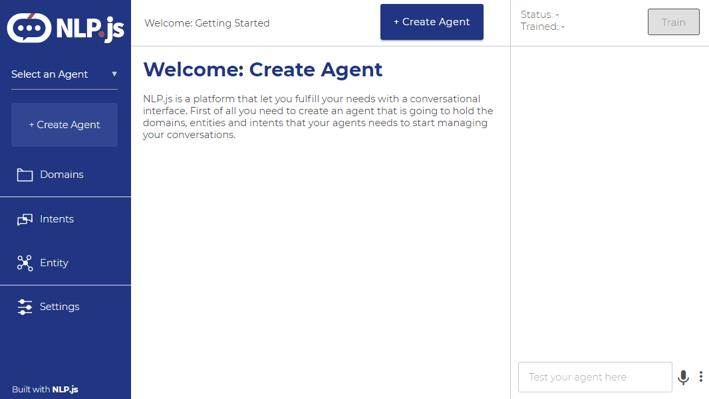
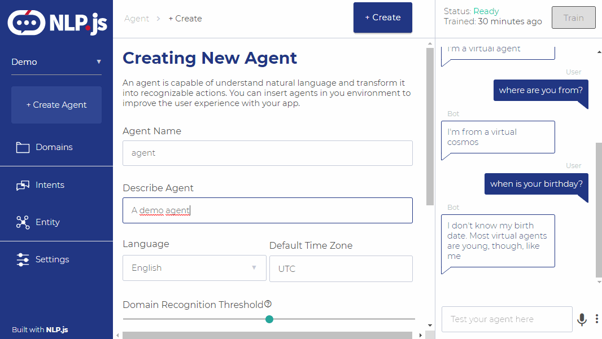
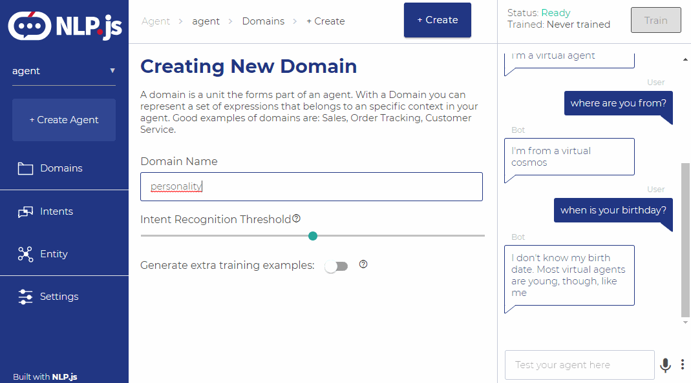
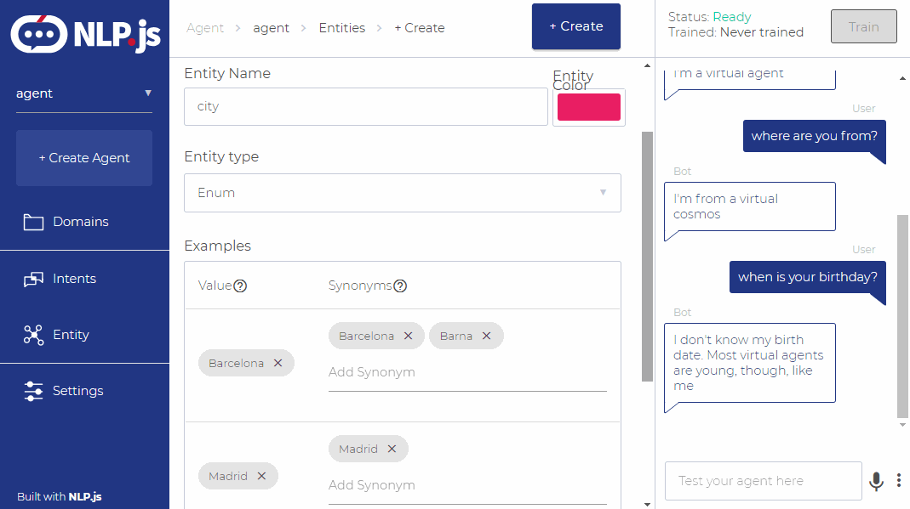
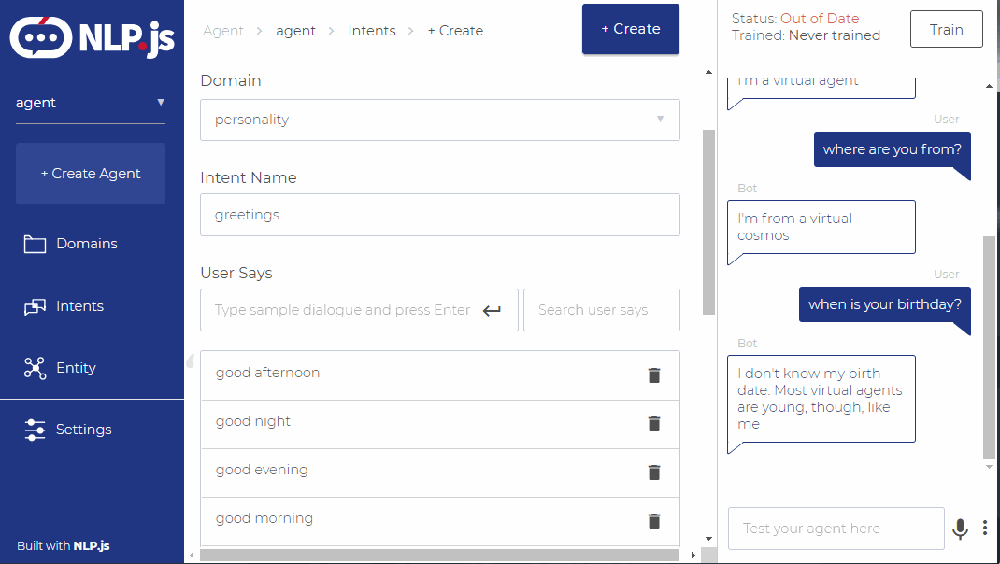
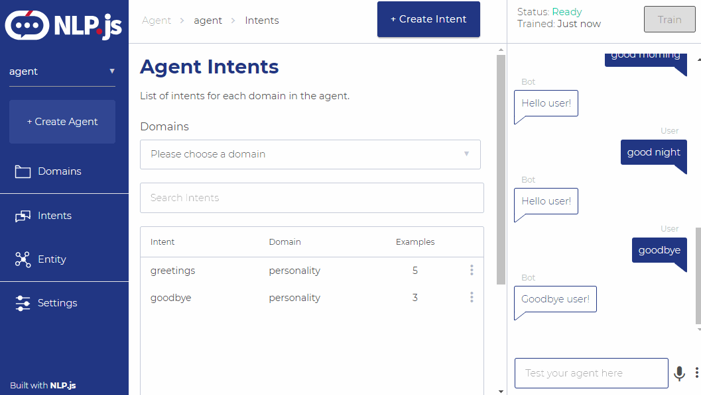
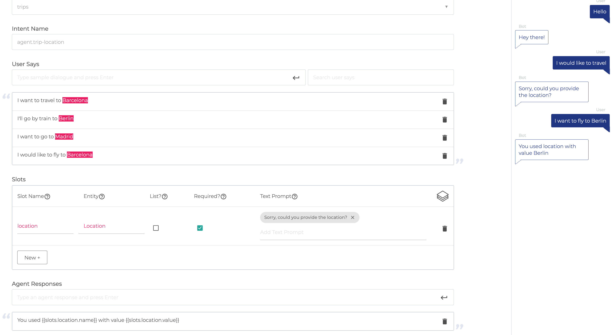
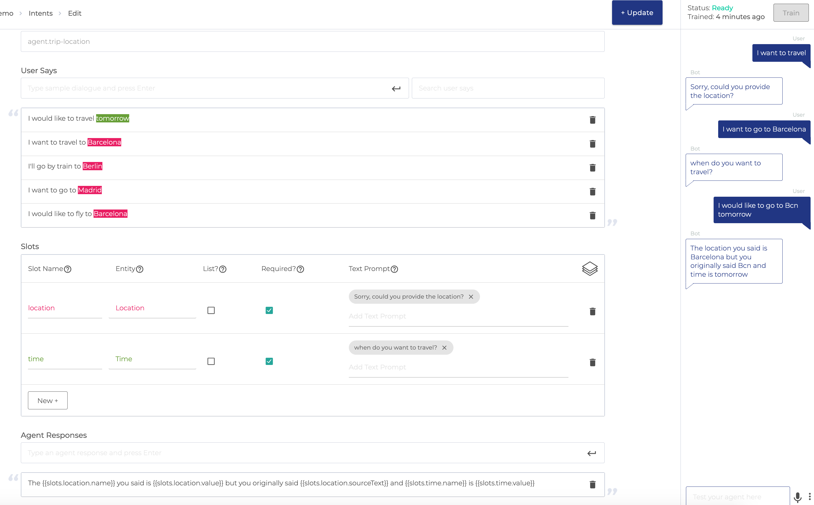

<div align="center">

</div>

# NLP.js App

[](https://heroku.com/deploy)

Application to train your agents for bots, done using NLP.js.

34 languages supported: Arabic (ar), Armenian (hy), Bengali (bn), Basque (eu), Catala (ca), Chinese (zh), Czech (cs), Danish (da), Dutch (nl), English (en), Farsi (fa), Finnish (fi), French (fr), Galician (gl), German (de), Greek (el), Hindi (hi), Hungarian (hu), Indonesian (id), Irish (ga), Italian (it), Japanese (ja), Norwegian (no), Portuguese (pt), Romanian (ro), Russian (ru), Slovene (sl), Spanish (es), Swedish (sv), Tagalog (tl), Tamil (ta), Thai (th), Turkish (tr), Ukrainian (uk)

<div align="center">

</div>

### TABLE OF CONTENTS

<!--ts-->

- [Installation](#installation)
- [Example of Use](#example-of-use)
- [Software Used](#software-used)
- [Contributing](#contributing)
- [Code of Conduct](#code-of-conduct)
- [Who is behind it](#who-is-behind-it)
- [License](#license.md)
  <!--te-->

## Installation

You have a one click installation for free in heroku, clicking the "deploy to heroku" button in this page.
If you want to use it on-premise, follow this steps:

- MongoDB is needed
- NodeJS is needed
- Clone this repo
- Run `npm install` to download dependencies
- Modify the .env at the root to point to your database (you have a .envexample you can use)
- Modify the .env at the client folder to point to the url and port of your backend
- Run `npm start` at the root folder
- Run `npm start` at the client folder (This step is OPTIONAL. Run if you want to make change in the front-end )

If you want to generate a production version, run `npm run build` at the client folder and copy the build contents to the public folder.

### Running in a different port

Example of application running in port 3010:

./.env
```
NODE_ENV=development
MONGO_URL=mongodb://localhost:27017/nlpjs
LOG_LEVEL=debug
PORT=3010
```

./client/.env
```
SETTINGS_URL=http://localhost:3010
API_URL=http://localhost:3010
PUBLIC_PATH_PREFIX=
```

Then, replace "public" folder content:
```
cd client
npm run build
cd ..
mv public public_old
mv client/build public
npm start
```

## Example of use

You can create an agent:

<div align="center">

</div>

Then create at least one domain:

<div align="center">

</div>

Create some entities if you need them:

<div align="center">

</div>

Create some intents:

<div align="center">

</div>

Train and test:

<div align="center">

</div>

### Slot filling

It's also possible to check required entities within an intent.

Example of basic slot filling:

<div align="center">

</div>

Example of multiple slot filling used in the same intent:

<div align="center">

</div>

## Docker Compose

A docker-compose receipt is available to allow a quick-start easily. Just execute:

**Start:**

```docker
docker-compose up
```

**Start detached:**

```docker
docker-compose up -d
```

**Stop:**

```docker
docker-compose down
```

It will start the Mongo database, [NLP.js](http://localhost:3000 "NLP.js app at localhost") application and a [Mongo Express](http://localhost:8081 "Mongo-Express at localhost") to allow inspect the collections.

## Software Used

This project is based on the Articulate Project from Samtec, that you can find here: https://github.com/samtecspg/articulate

## Contributing

You can read the guide of how to contribute at [Contributing](https://github.com/axa-group/nlp.js-app/blob/master/CONTRIBUTING.md).

## Code of Conduct

You can read the Code of Conduct at [Code of Conduct](https://github.com/axa-group/nlp.js-app/blob/master/CODE_OF_CONDUCT.md).

## Who is behind it?

This project is developed by AXA Group Operations Spain S.A.

If you need to contact us, you can do it at the email jesus.seijas@axa.com

## License

Copyright (c) AXA Group Operations Spain S.A.

Permission is hereby granted, free of charge, to any person obtaining
a copy of this software and associated documentation files (the
"Software"), to deal in the Software without restriction, including
without limitation the rights to use, copy, modify, merge, publish,
distribute, sublicense, and/or sell copies of the Software, and to
permit persons to whom the Software is furnished to do so, subject to
the following conditions:

The above copyright notice and this permission notice shall be
included in all copies or substantial portions of the Software.

THE SOFTWARE IS PROVIDED "AS IS", WITHOUT WARRANTY OF ANY KIND,
EXPRESS OR IMPLIED, INCLUDING BUT NOT LIMITED TO THE WARRANTIES OF
MERCHANTABILITY, FITNESS FOR A PARTICULAR PURPOSE AND
NONINFRINGEMENT. IN NO EVENT SHALL THE AUTHORS OR COPYRIGHT HOLDERS BE
LIABLE FOR ANY CLAIM, DAMAGES OR OTHER LIABILITY, WHETHER IN AN ACTION
OF CONTRACT, TORT OR OTHERWISE, ARISING FROM, OUT OF OR IN CONNECTION
WITH THE SOFTWARE OR THE USE OR OTHER DEALINGS IN THE SOFTWARE.
